# Learn how to use Oracle Cloud API Gateway to Authenticate with OAuth2 and Call an OCI Service with fn and OCI SDK

## Introduction

We often need our applications to consume OCI REST services. There are several ways to guarantee security between components, ensuring that the application can authenticate securely to the backend service.

Most of the time, this task is native within the Oracle Cloud, as there are several ways to secure the network and access to existing services. Just a few settings and you're done.

However, there are cases where the application may offer additional security and connectivity requirements. 

The use case of this material meets a very common need in the hybrid or multi-cloud scenario (on-premises connected to the Oracle cloud, or Oracle cloud connected to another cloud).

Let's present the following scenario:

- Application on an on-premises network connected to Oracle Cloud through Fast-Connect/VPN
- Application needs to consume an OCI Data Science service
- OCI service does not have an authentication mechanism that meets the application consumer's possibilities
- Application needs to authenticate using OAuth2 to be able to access the service securely

Therefore, the material provides the following solution:

- Configure the Oracle IDCS cloud's own Identity Provider to authenticate through OAuth2
- Configure OCI API Gateway to integrate with IDCS to authenticate via an obtained token
- Code an fn to call an OCI service that allows the use of Resource Principal (in our example, we will use the Data Science Model Deployment service)
- Create groups and policies to limit access to cloud resources
- Deliver an Identity Provider that allows you to pass the Client ID and Secret ID and obtain an authentication token
- Deliver a functional API Gateway REST service that authenticates through the obtained token and provides the result of the Data Science service

>**Note**: The **OCI fn** code can be downloaded [here](./files/OAuthOCIService-fn.zip)

## Objectives

- Allow an external application to consume REST services with OAuth2 authentication
- Provide an OAuth2 authentication service on OCI
- Configure OCI API Gateway and fn to run OCI services via a token

## Prerequisites

- An OCI API Gateway instance created and exposed to the Internet, see [Creating Your First API Gateway In The Oracle Cloud](https://blogs.oracle.com/developers/post/creating-your-first-api-gateway-in-the-oracle-cloud).
- Network Connectivity between OCI API Gateway, fn and OCI PaaS Resource
    - VCN/Subnets
    - Security List
    - Nat Gateway/Internet Gateway
    - Public/Private Networks
- Knowledge with the
  - OCI Functions
  - OCI REST API to code a call for the OCI Service 

## Task 1: Configure OAuth2 with IDCS

### Obtain the OCI API Gateway parameters

Let's start to configure the OAuth2 mechanism. We need to integrate your OCI API Gateway instance to an Identity Provider, in this example, we will configure the IDCS from Oracle Cloud to be these identity provider.

Go to the OCI API Gateway Instance and copy your hostname. This information will be used in your IDCS resource server configuration in the next step.

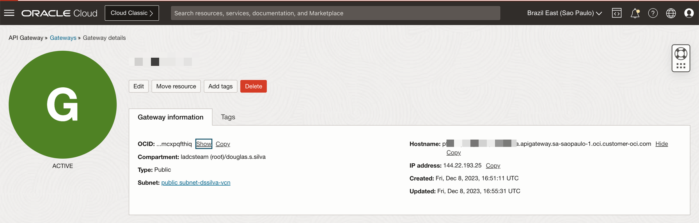

### Create a Resource Application

Now we need to create an OAuth2 authorizer for your application. 
We can do it with the IDCS in Oracle Cloud. 

In the OCI Console, go to "Identity & Security" and select "Federation".

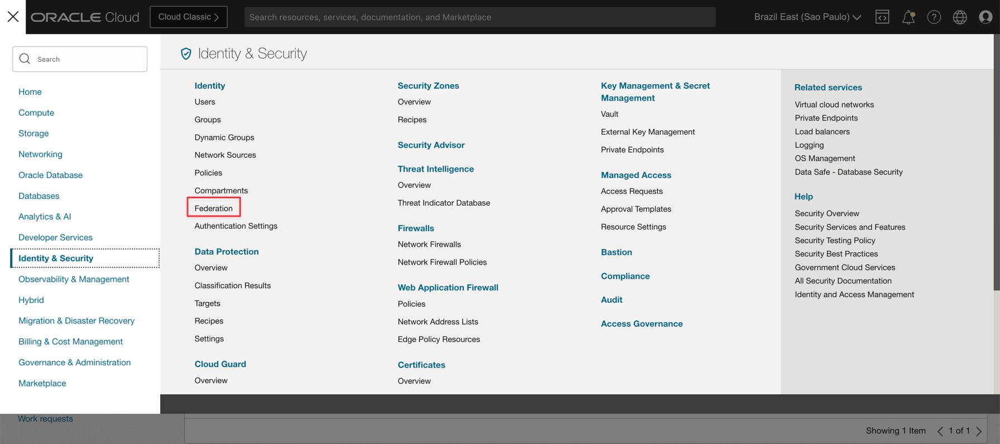

Now click in the "OracleIdentityCloudSevice" link.

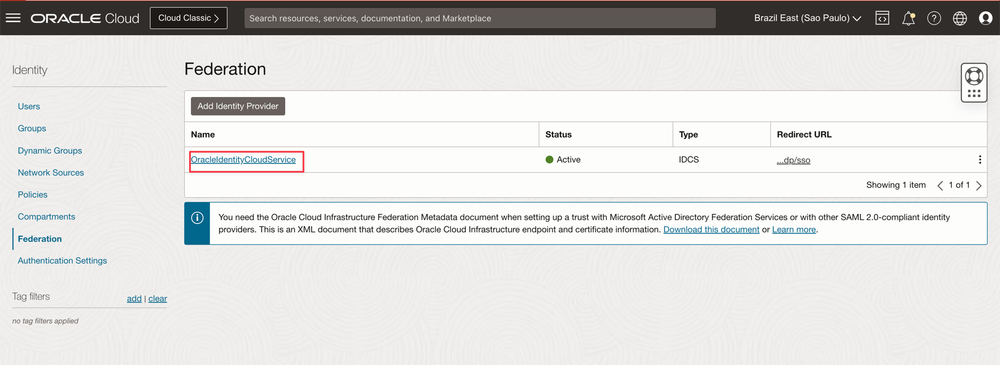

And click in the link for your IDCS instance.

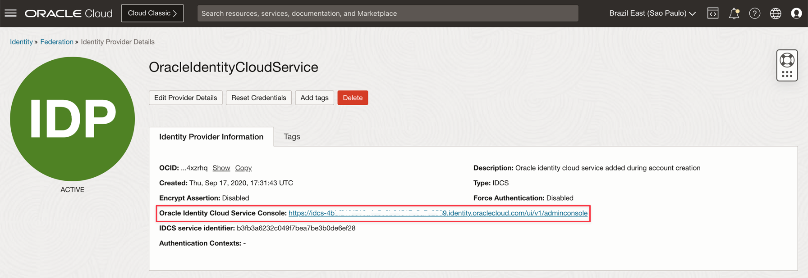

Now, we will create 2 applications. Click in the Applications and Services option.

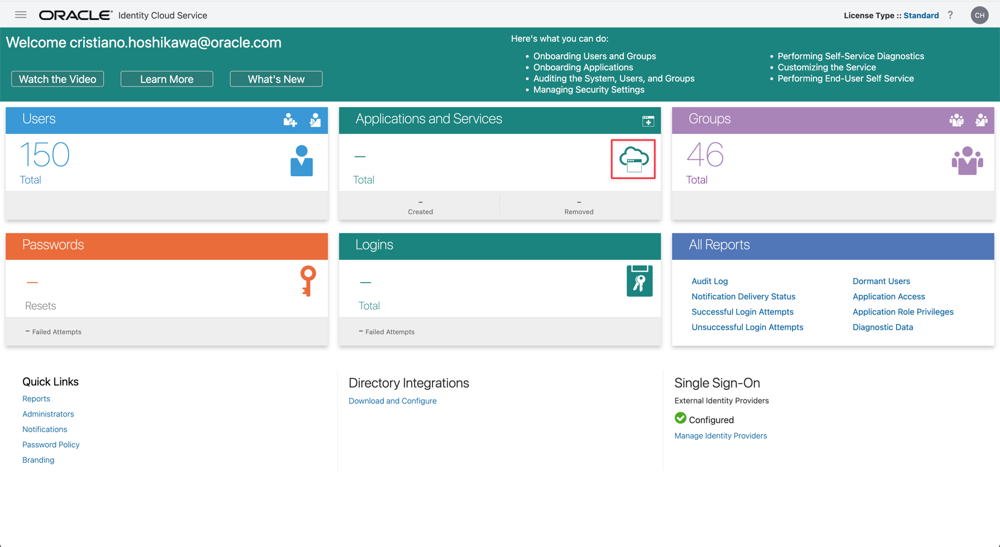

In the Applications, click the Add button

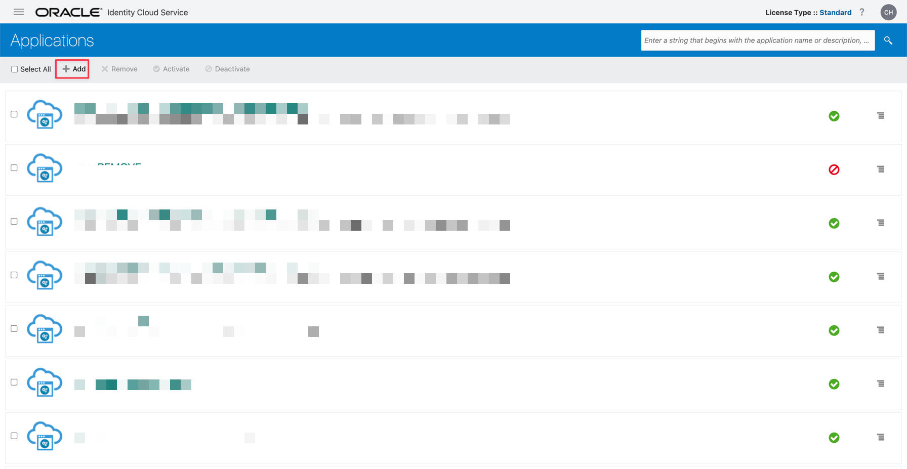

Select "Confidential Application" to start to configure your Resource Server.

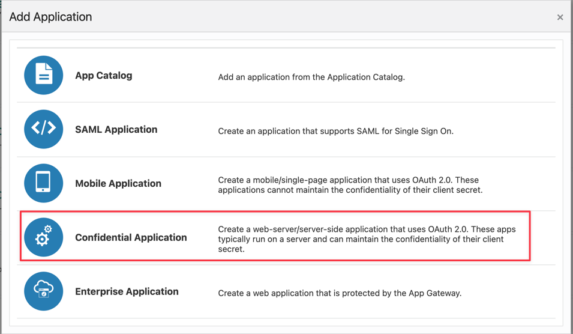

Now we will configure the first application. Put a name in your resource server application and click Next.

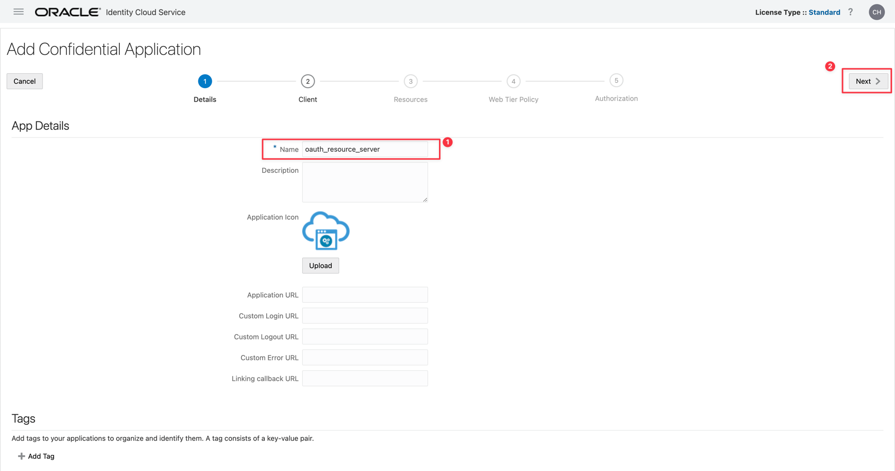

Skip this step. We need to configure the resource only.

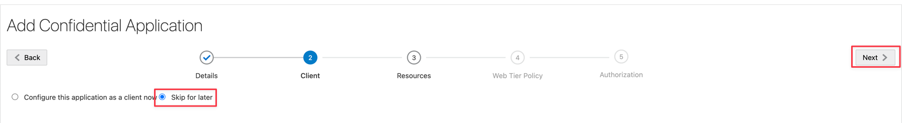

Now, put your OCI API Gateway hostname obtained in the last step

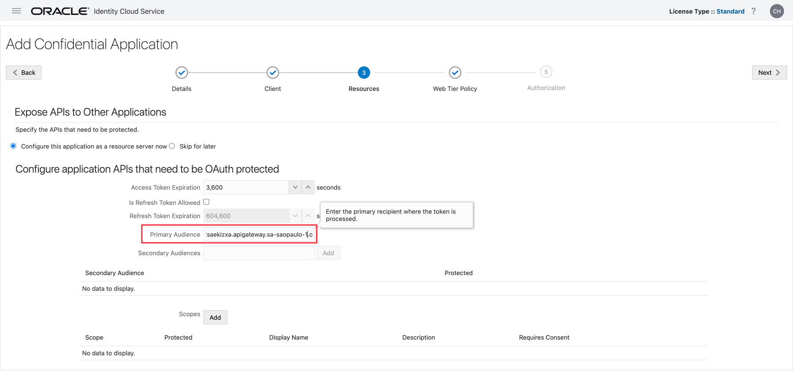

Click in the Add Scope button and fill with a scope information. 

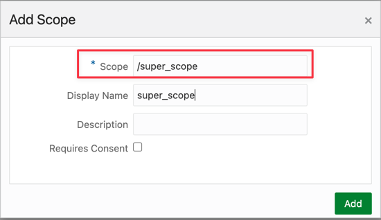

Verify your scope information and click Next 2 times and finally click Finish.

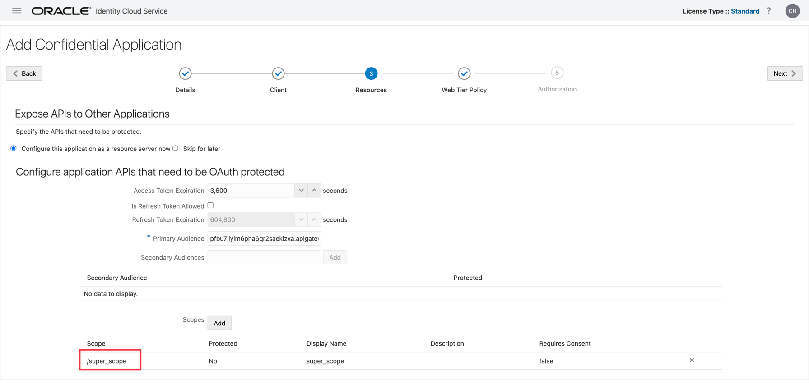

Activate your application.

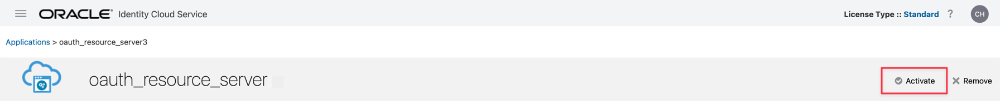

### Create a Client Application

In the Applications, click the Add button

Select "Confidential Application" to start to configure your Resource Server.

Put a name for your application and click Next button

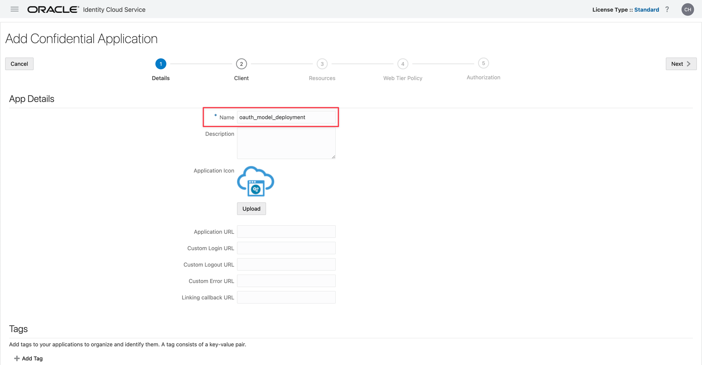

Select "Configure the application as a cliente now" to enable the configurations for your client application.
After this, you will see the parameters.

Now, select "Client Credentials" and "JWT Assertion" options and "On behalf of". Don't  click Next yet.

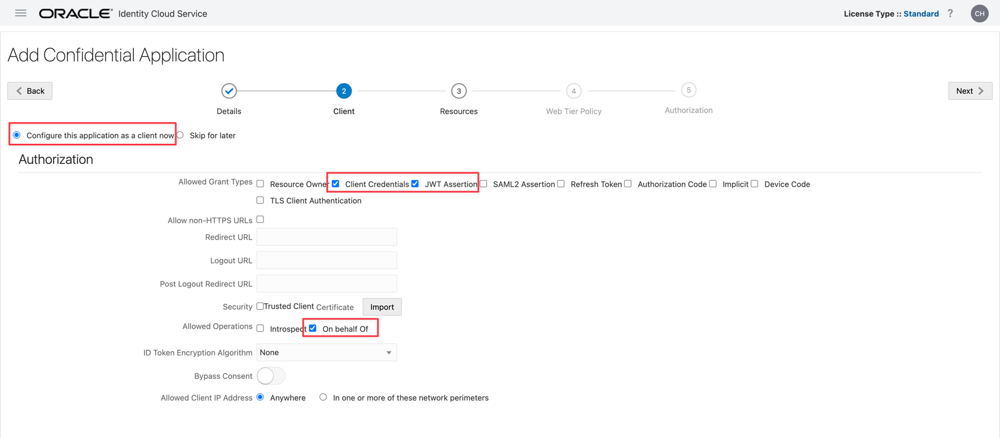

Roll down the screen and click in the "Add Scope" button.

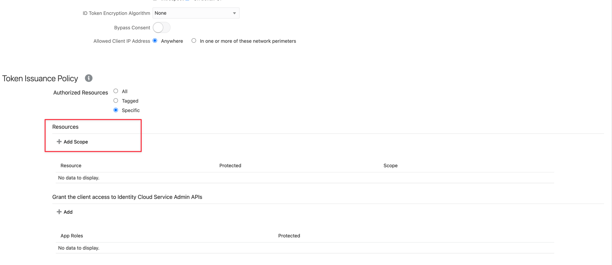

Find your Resource Application created before (oauth_resource_server in this example) and click Add button.

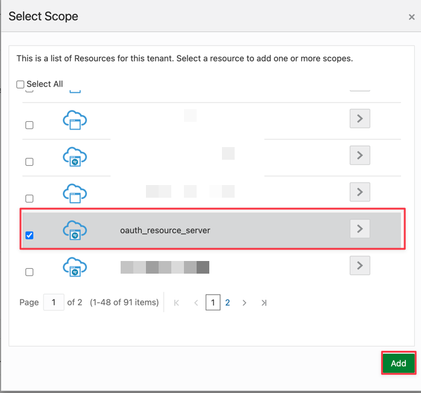

You can see your scope added to your application. Click Next button

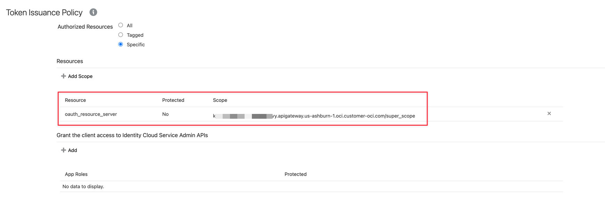

>**Note**: Keep the scope value, you will need to use to request a token

Skip the Resources and the Web Tier Policy step. In the last step, select "Enforce Grants as Authorization" option and click Finish button.

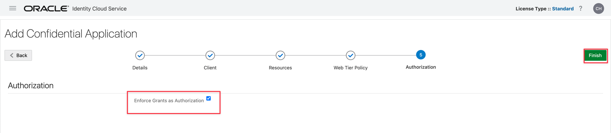

Keep the Client ID and the Client Secret information. You will need this to obtain your Token.

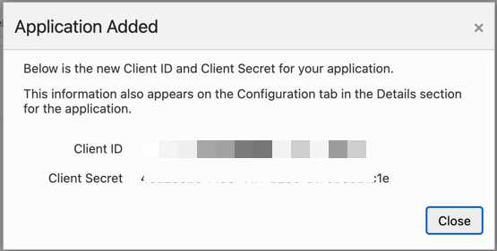

Activate your application and your OAuth2 authorizer is ready to test

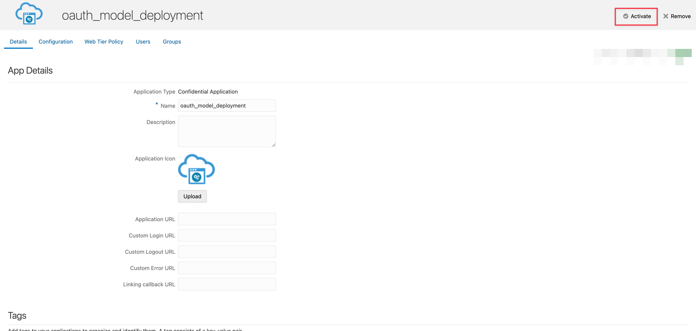

### Get a token

Now we can test the OAuth2 Authorizer to obtain the token.

The first step is to compose the URL for the authorizer. You can obtain this by getting your IDCS url in the browser.
In the IDCS URL, you can see something like this:

    https://idcs-xxxxxxxxxxxxx.identity.oraclecloud.com/ui/v1/adminconsole

You will need the URL link until the oraclecloud.com. So, this is the root endpoint:

    https://idcs-xxxxxxxxxxxxx.identity.oraclecloud.com

Now, we need to add the oauth authentication path. This URL will be executed as a POST REST request.

    https://idcs-xxxxxxxxxxxxx.identity.oraclecloud.com/oauth2/v1/token

You will need to put some paramters to request the token.

First, put the Credentials as a Basic Authentication. You will put the Client ID and your Client Secret.

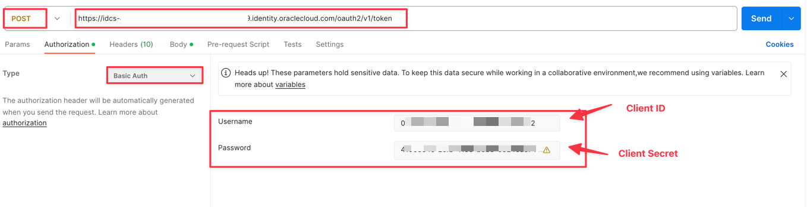

Now, in the Body content, fill with the grant_type and scope values.
Remember, the scope was captured in the IDCS configuration

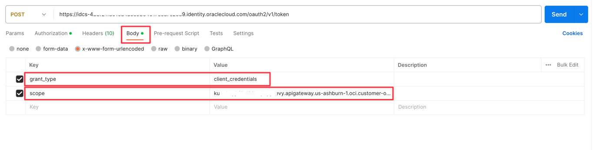

Execute the POST Request and view the Token

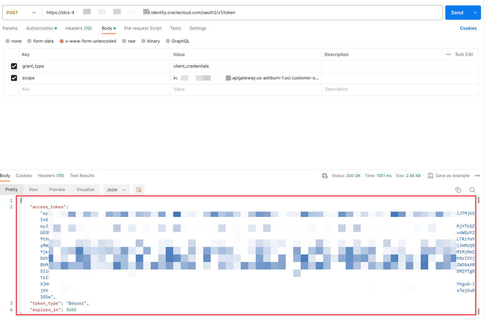

## Create the JSON Web Key

In your browser, put the root IDCS endpoint adding the **/admin/v1/SigningCert/jwk** to obtain the jwk

    https://idcs-xxxxxxxxxxxxx.identity.oraclecloud.com/admin/v1/SigningCert/jwk

You will receive a jwk string like this example

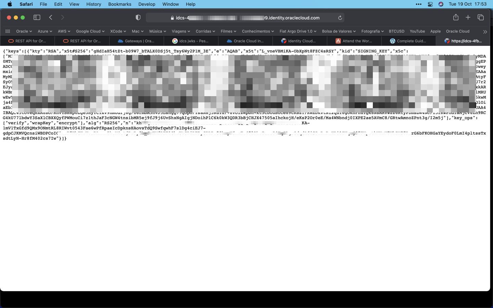
    

We need to work on this JWK string:

    {"keys":[{"kty":"RSA","x5t#S256":"gHdIaH54tZt-b09W7_bTALX0DSj5t_Tsy6Wy2P1M_3E","e":"AQAB","x5t":"L_vneVBMiKA-ObXpNt8FZC4sRSY","kid":"SIGNING_KEY","x5c":["MIIDYTCCAkmgAwIBAgIGAXRBgoJkiaJk/IsZAEZFgNjb20xFjAUBgoJkiaJk/IsZAEZFgZvcmFjbGUxFTATBgoJkiaJk/IsZAEZFgVjEtMjAeFw0yMDA0MTcxMDU3NTRaFw0zMDA0MTcxMDU3NTRaMFYxEzARBgNVBAMTCnNzbERvbWFpbnMxDzGA1UEAxMlaWRjcy00ZmI0N2I5MTYxMzA0YjFkYTI2ZjZlZDE2MTlhNGUwOTCCASIwDQYJKoZIhvcNAQJIXyaojue8TJXIuJrb4qxBqA3z35bC1kHdxtGZEEJUCtkHK2kEUD5GqD/C6OijCgPtZldU8Rn3fUDMfTjZrUS/ESFr7dOeNxWnusD30aWniHIRe7JQ4OHIhCe/oHaQiSjFUHJ7IlgQzwqCAtccweymxiq1r2jwJscdYaDOHrYz8AcvIfybxzHwT8hgSz7+dIZsjepp07uO5QYcyMM3meB6mS4KznanQOokmawcUcxw4tSFqqI/OxWKc7ZBMnaBdC5iOKZbbLE8bHbS8jfh6/HzONNnLOyMCAwEAAaMyMDAwDwYDVR0PAQH/BAUDAwf4ADAdBgNVHQ4EFgQUd415wDQYJKoZIhvcNAQELBQADggEBAClHD810UCnRuvS7Rbtp5UFTzeRvexDe+Jk6/1FdcfW4COWLRVrgY45XHQr2GmhPWC1G2Yn8WczkIErpX+LAtyFSyOYzBq1GjzpSLhqS/aNWstGVmPDLs+xySyRlBTPgFqsyl/kpIjyusKswUo57X77B7S+KzH4hvGsA6gj55ZLAynSnzMtPs+2Ij4F3PgkgJG7zxHs9HOuyuZtCKJAldVv7IFaQYv6yMjH7llehQOMwp1YPh54kk8M4yk1IIgi/Hw4Tr/HbU7r2EJyaHfxFZgck1Cr9nBIspANy5BDlFYeAnTmKk3UAafbZdSMfeJFd/XwaPlhIzNEJYGW3T4Y5d8o=","MIIDazCCAlOgAwIBAgIIMdQl7kIMrv0wDQYJKoZIhvcNAQELBQAwWTETMBEGCgmSJomT8ixkARkWA2NvbTEWMBQGCgmSJomT8ixkARkWBm9yYWNsZTEVMBMGCgmSJomT8ixkARkWBWNsb3VkMRMwEQYDVQQDEwpDbG91ZDlDQS0yMCAXDTE2MDUyMTAyMTgwOVoYDzIxMTYwNDI3MDIxODA5WjBZMRMwEQYKCZImiZPyLGQBGRYDY29tMRYwFAYKCZImiZPyLGQBGRYGb3JhY2xlMRUwEwYKCZImiZPyLGQBGRYFY2xvdWQxEzARBgNVBAMTCkNsb3VkOUNBLTIwggEiMA0GCSqGSIb3DQEBAQUAA4IBDwAwggEKAoIBAQDPZn2VAoMsIfWmIJks9exzK+DXaX6qYyBc12dRqDrRpC48v3CBeBchV/GT2E+mjcDp8Hzq8oIpwr9W5kwMja4PU3SPd4/0LB6WKbtLfHOnJxLg9EaT992UpbUGHaHlEq4oRAuVvPgDLp5sSspLZYEBKUh4vJXOyLitE1qsXn7mJNXRKTJZvrJKdfbs1dyTge3V3wk1rwY/wCWMKVgkqCgSzzWCGju8EZWoOrnzlR6BHkA0qZqeV4F7jDW8ucdv+Y20pOlOiaEbIg/ZFYGrZd5VWjlNvgLfU8P4C/YJLSkkcPHgoet3w4jI0S26efu59rVzgU9VsKnKtnqbDL99t81vAgMBAAGjNTAzMBIGA1UdEwEB/wQIMAYBAf8CAQAwHQYDVR0OBBYEFDMA8e55FI5kC12+guIE9xtcIXpFMA0GCSqGSIb3DQEBCwUAA4IBAQC45tOVeqHxA8Bo/Rnv1SHHpULge3HyTC1XV9nmUdrj6g/U6rmbA5hVJ5LshgQ77qopO/YsaNHj5Ru1u/+8VOlZWpbn+kt3CDOuBUCe89CKBZT/KWEDkvtNl2qu16gOkhFnuTQk8NsARvwZZ6KtyPDmsbW4Nc/I5fKwPhdTaMjCV6Lh9RCG4kU77lbdwY3SaXlCBXXQyfPWMouCi7z1thJaF3cNGW4tnsibMR5ej9fJ9j6UvShxNgAIgjNDoihPlC6k0kW3QDR3bBjCHJX47505aIhckojH/eKsP2Or0eE/Ma4WNbndj0IXPE2ae5AVmC8/GRtwAmnoZPnt3g/I2m5j"],"key_ops":["sig","encrypt"],"alg":"RS256","n":"khfJqiO57xMlci4mtvirEGoDfPflsLWQd3G0ZkQQlQK2QcraQRQPkaoP8Lo6KMKA-1mV1TxGfd9QMx9ONmtRL8RIWvt0543Fae6wPfRpaeIcDpknsHAovsTdQ9SwfqwhF7slDg4ciEJ7-gdpCJKMVQcnsiWBDPCoIC1xzB7KbGKrWvaPAmxx1hoM4etjPwBy8h_JvHMfDEF1GkrUtCDiLFPyGBLPv50hmyN6mnTu47lBhzIwzeZ4HqZLgrOdqdA6iSZrBxRzHDi1IWqoj87FYpztkWXnV7VkIN37RwrG6bFKOHGaYEydoF0LmI4pltssTxsdtLyN-Hr8fM402cs7Iw"}]}
    
    Note: This JWK was redacted

### Very Important Change

The JWK string will not be useful in the **OCI API Gateway** until you make some changes.

1. Find the segment with **"key_ops":["x","y","z"]** and replace with **"use" : "sig"**

This will be like this (compare the 2 strings):

    {"keys":[{"kty":"RSA","x5t#S256":"gHdIaH54tZt-b09W7_bTALX0DSj5t_Tsy6Wy2P1M_3E","e":"AQAB","x5t":"L_vneVBMiKA-ObXpNt8FZC4sRSY","kid":"SIGNING_KEY","x5c":["MIIDYTCCAkmgAwIBAgIGAXRBgoJkiaJk/IsZAEZFgNjb20xFjAUBgoJkiaJk/IsZAEZFgZvcmFjbGUxFTATBgoJkiaJk/IsZAEZFgVjEtMjAeFw0yMDA0MTcxMDU3NTRaFw0zMDA0MTcxMDU3NTRaMFYxEzARBgNVBAMTCnNzbERvbWFpbnMxDzGA1UEAxMlaWRjcy00ZmI0N2I5MTYxMzA0YjFkYTI2ZjZlZDE2MTlhNGUwOTCCASIwDQYJKoZIhvcNAQJIXyaojue8TJXIuJrb4qxBqA3z35bC1kHdxtGZEEJUCtkHK2kEUD5GqD/C6OijCgPtZldU8Rn3fUDMfTjZrUS/ESFr7dOeNxWnusD30aWniHIRe7JQ4OHIhCe/oHaQiSjFUHJ7IlgQzwqCAtccweymxiq1r2jwJscdYaDOHrYz8AcvIfybxzHwT8hgSz7+dIZsjepp07uO5QYcyMM3meB6mS4KznanQOokmawcUcxw4tSFqqI/OxWKc7ZBMnaBdC5iOKZbbLE8bHbS8jfh6/HzONNnLOyMCAwEAAaMyMDAwDwYDVR0PAQH/BAUDAwf4ADAdBgNVHQ4EFgQUd415wDQYJKoZIhvcNAQELBQADggEBAClHD810UCnRuvS7Rbtp5UFTzeRvexDe+Jk6/1FdcfW4COWLRVrgY45XHQr2GmhPWC1G2Yn8WczkIErpX+LAtyFSyOYzBq1GjzpSLhqS/aNWstGVmPDLs+xySyRlBTPgFqsyl/kpIjyusKswUo57X77B7S+KzH4hvGsA6gj55ZLAynSnzMtPs+2Ij4F3PgkgJG7zxHs9HOuyuZtCKJAldVv7IFaQYv6yMjH7llehQOMwp1YPh54kk8M4yk1IIgi/Hw4Tr/HbU7r2EJyaHfxFZgck1Cr9nBIspANy5BDlFYeAnTmKk3UAafbZdSMfeJFd/XwaPlhIzNEJYGW3T4Y5d8o=","MIIDazCCAlOgAwIBAgIIMdQl7kIMrv0wDQYJKoZIhvcNAQELBQAwWTETMBEGCgmSJomT8ixkARkWA2NvbTEWMBQGCgmSJomT8ixkARkWBm9yYWNsZTEVMBMGCgmSJomT8ixkARkWBWNsb3VkMRMwEQYDVQQDEwpDbG91ZDlDQS0yMCAXDTE2MDUyMTAyMTgwOVoYDzIxMTYwNDI3MDIxODA5WjBZMRMwEQYKCZImiZPyLGQBGRYDY29tMRYwFAYKCZImiZPyLGQBGRYGb3JhY2xlMRUwEwYKCZImiZPyLGQBGRYFY2xvdWQxEzARBgNVBAMTCkNsb3VkOUNBLTIwggEiMA0GCSqGSIb3DQEBAQUAA4IBDwAwggEKAoIBAQDPZn2VAoMsIfWmIJks9exzK+DXaX6qYyBc12dRqDrRpC48v3CBeBchV/GT2E+mjcDp8Hzq8oIpwr9W5kwMja4PU3SPd4/0LB6WKbtLfHOnJxLg9EaT992UpbUGHaHlEq4oRAuVvPgDLp5sSspLZYEBKUh4vJXOyLitE1qsXn7mJNXRKTJZvrJKdfbs1dyTge3V3wk1rwY/wCWMKVgkqCgSzzWCGju8EZWoOrnzlR6BHkA0qZqeV4F7jDW8ucdv+Y20pOlOiaEbIg/ZFYGrZd5VWjlNvgLfU8P4C/YJLSkkcPHgoet3w4jI0S26efu59rVzgU9VsKnKtnqbDL99t81vAgMBAAGjNTAzMBIGA1UdEwEB/wQIMAYBAf8CAQAwHQYDVR0OBBYEFDMA8e55FI5kC12+guIE9xtcIXpFMA0GCSqGSIb3DQEBCwUAA4IBAQC45tOVeqHxA8Bo/Rnv1SHHpULge3HyTC1XV9nmUdrj6g/U6rmbA5hVJ5LshgQ77qopO/YsaNHj5Ru1u/+8VOlZWpbn+kt3CDOuBUCe89CKBZT/KWEDkvtNl2qu16gOkhFnuTQk8NsARvwZZ6KtyPDmsbW4Nc/I5fKwPhdTaMjCV6Lh9RCG4kU77lbdwY3SaXlCBXXQyfPWMouCi7z1thJaF3cNGW4tnsibMR5ej9fJ9j6UvShxNgAIgjNDoihPlC6k0kW3QDR3bBjCHJX47505aIhckojH/eKsP2Or0eE/Ma4WNbndj0IXPE2ae5AVmC8/GRtwAmnoZPnt3g/I2m5j"],"use" : "sig","alg":"RS256","n":"khfJqiO57xMlci4mtvirEGoDfPflsLWQd3G0ZkQQlQK2QcraQRQPkaoP8Lo6KMKA-1mV1TxGfd9QMx9ONmtRL8RIWvt0543Fae6wPfRpaeIcDpknsHAovsTdQ9SwfqwhF7slDg4ciEJ7-gdpCJKMVQcnsiWBDPCoIC1xzB7KbGKrWvaPAmxx1hoM4etjPwBy8h_JvHMfDEF1GkrUtCDiLFPyGBLPv50hmyN6mnTu47lBhzIwzeZ4HqZLgrOdqdA6iSZrBxRzHDi1IWqoj87FYpztkWXnV7VkIN37RwrG6bFKOHGaYEydoF0LmI4pltssTxsdtLyN-Hr8fM402cs7Iw"}]}

2. Remove these strings in the beginning and ending

>{"keys":[

>]}
 
The final string will be

    {"kty":"RSA","x5t#S256":"gHdIaH54tZt-b09W7_bTALX0DSj5t_Tsy6Wy2P1M_3E","e":"AQAB","x5t":"L_vneVBMiKA-ObXpNt8FZC4sRSY","kid":"SIGNING_KEY","x5c":["MIIDYTCCAkmgAwIBAgIGAXRBgoJkiaJk/IsZAEZFgNjb20xFjAUBgoJkiaJk/IsZAEZFgZvcmFjbGUxFTATBgoJkiaJk/IsZAEZFgVjEtMjAeFw0yMDA0MTcxMDU3NTRaFw0zMDA0MTcxMDU3NTRaMFYxEzARBgNVBAMTCnNzbERvbWFpbnMxDzGA1UEAxMlaWRjcy00ZmI0N2I5MTYxMzA0YjFkYTI2ZjZlZDE2MTlhNGUwOTCCASIwDQYJKoZIhvcNAQJIXyaojue8TJXIuJrb4qxBqA3z35bC1kHdxtGZEEJUCtkHK2kEUD5GqD/C6OijCgPtZldU8Rn3fUDMfTjZrUS/ESFr7dOeNxWnusD30aWniHIRe7JQ4OHIhCe/oHaQiSjFUHJ7IlgQzwqCAtccweymxiq1r2jwJscdYaDOHrYz8AcvIfybxzHwT8hgSz7+dIZsjepp07uO5QYcyMM3meB6mS4KznanQOokmawcUcxw4tSFqqI/OxWKc7ZBMnaBdC5iOKZbbLE8bHbS8jfh6/HzONNnLOyMCAwEAAaMyMDAwDwYDVR0PAQH/BAUDAwf4ADAdBgNVHQ4EFgQUd415wDQYJKoZIhvcNAQELBQADggEBAClHD810UCnRuvS7Rbtp5UFTzeRvexDe+Jk6/1FdcfW4COWLRVrgY45XHQr2GmhPWC1G2Yn8WczkIErpX+LAtyFSyOYzBq1GjzpSLhqS/aNWstGVmPDLs+xySyRlBTPgFqsyl/kpIjyusKswUo57X77B7S+KzH4hvGsA6gj55ZLAynSnzMtPs+2Ij4F3PgkgJG7zxHs9HOuyuZtCKJAldVv7IFaQYv6yMjH7llehQOMwp1YPh54kk8M4yk1IIgi/Hw4Tr/HbU7r2EJyaHfxFZgck1Cr9nBIspANy5BDlFYeAnTmKk3UAafbZdSMfeJFd/XwaPlhIzNEJYGW3T4Y5d8o=","MIIDazCCAlOgAwIBAgIIMdQl7kIMrv0wDQYJKoZIhvcNAQELBQAwWTETMBEGCgmSJomT8ixkARkWA2NvbTEWMBQGCgmSJomT8ixkARkWBm9yYWNsZTEVMBMGCgmSJomT8ixkARkWBWNsb3VkMRMwEQYDVQQDEwpDbG91ZDlDQS0yMCAXDTE2MDUyMTAyMTgwOVoYDzIxMTYwNDI3MDIxODA5WjBZMRMwEQYKCZImiZPyLGQBGRYDY29tMRYwFAYKCZImiZPyLGQBGRYGb3JhY2xlMRUwEwYKCZImiZPyLGQBGRYFY2xvdWQxEzARBgNVBAMTCkNsb3VkOUNBLTIwggEiMA0GCSqGSIb3DQEBAQUAA4IBDwAwggEKAoIBAQDPZn2VAoMsIfWmIJks9exzK+DXaX6qYyBc12dRqDrRpC48v3CBeBchV/GT2E+mjcDp8Hzq8oIpwr9W5kwMja4PU3SPd4/0LB6WKbtLfHOnJxLg9EaT992UpbUGHaHlEq4oRAuVvPgDLp5sSspLZYEBKUh4vJXOyLitE1qsXn7mJNXRKTJZvrJKdfbs1dyTge3V3wk1rwY/wCWMKVgkqCgSzzWCGju8EZWoOrnzlR6BHkA0qZqeV4F7jDW8ucdv+Y20pOlOiaEbIg/ZFYGrZd5VWjlNvgLfU8P4C/YJLSkkcPHgoet3w4jI0S26efu59rVzgU9VsKnKtnqbDL99t81vAgMBAAGjNTAzMBIGA1UdEwEB/wQIMAYBAf8CAQAwHQYDVR0OBBYEFDMA8e55FI5kC12+guIE9xtcIXpFMA0GCSqGSIb3DQEBCwUAA4IBAQC45tOVeqHxA8Bo/Rnv1SHHpULge3HyTC1XV9nmUdrj6g/U6rmbA5hVJ5LshgQ77qopO/YsaNHj5Ru1u/+8VOlZWpbn+kt3CDOuBUCe89CKBZT/KWEDkvtNl2qu16gOkhFnuTQk8NsARvwZZ6KtyPDmsbW4Nc/I5fKwPhdTaMjCV6Lh9RCG4kU77lbdwY3SaXlCBXXQyfPWMouCi7z1thJaF3cNGW4tnsibMR5ej9fJ9j6UvShxNgAIgjNDoihPlC6k0kW3QDR3bBjCHJX47505aIhckojH/eKsP2Or0eE/Ma4WNbndj0IXPE2ae5AVmC8/GRtwAmnoZPnt3g/I2m5j"],"use" : "sig","alg":"RS256","n":"khfJqiO57xMlci4mtvirEGoDfPflsLWQd3G0ZkQQlQK2QcraQRQPkaoP8Lo6KMKA-1mV1TxGfd9QMx9ONmtRL8RIWvt0543Fae6wPfRpaeIcDpknsHAovsTdQ9SwfqwhF7slDg4ciEJ7-gdpCJKMVQcnsiWBDPCoIC1xzB7KbGKrWvaPAmxx1hoM4etjPwBy8h_JvHMfDEF1GkrUtCDiLFPyGBLPv50hmyN6mnTu47lBhzIwzeZ4HqZLgrOdqdA6iSZrBxRzHDi1IWqoj87FYpztkWXnV7VkIN37RwrG6bFKOHGaYEydoF0LmI4pltssTxsdtLyN-Hr8fM402cs7Iw"}

Now you can use it.

## Task 2: Configure a fn to call your OCI SDK API

### Understand the OCI Functions and API Gateway

It's a best practice to expose your services through an API Gateway. Many authentications can be done bypassing the credentials from API Gateway to the backend services, but if the backend authentication was not the apropriate method to your client application, we can do some configurations in the API Gateway level.

In this step, let's understand how **OCI API Gateway** can help us to integrate the OAuth2 authentication and the request for any OCI Service, like the Data Science Model Deployment prediction through the **OCI Functions**.

**OCI Functions** can do the job to receive the body request and pass to the OCI Service. Some services in the OCI Service cannot authenticate by OAuth2 method, so we can do it with OCI Functions.

In this example, the Model Deployment prediction service can authenticate by the OCI Private key in OCI IAM. It can be done by the [Resource Principal](https://accelerated-data-science.readthedocs.io/en/latest/user_guide/cli/authentication.html).

If you don't know how to create and deploy a **OCI fn**, please see [OCI Functions Quickstart](https://docs.oracle.com/en-us/iaas/developer-tutorials/tutorials/functions/func-setup-cli/01-summary.htm)

### Understand the code

This code will be prepared to be used with **OCI API Gateway**. In your API Deployment, we will configure the Model Deployment endpoint in the API Gateway and it will be passed as a HEADER parameter. So you can use this function for many Model Deployments in each API Gateway deployments you need.

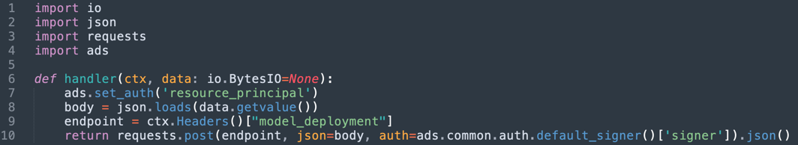

We will use the **oracle.ads** library in Python to authorize by **Resource Principal** the access of this (fn) function to the Model Deployment instance. (See the Task 4)  

    ads.set_auth('resource_principal')

And the body content can be captured by this code

    body = json.loads(data.getvalue())

In the next sentence, we will configure in the **OCI API Gateway** a HEADER named **model_deployment**. This HEADER contains the URL for the Model Deployment Prediction passed in the API Gateway request

    endpoint = ctx.Headers()["model_deployment"]

This will execute the REST API POST request and return the result from the Model Deployment in Data Science endpoint

    return requests.post(endpoint, json=body, auth=ads.common.auth.default_signer()['signer']).json()

This is the **requirements.txt** libraries that will need to be loaded in this (fn) functions.

    requirements.txt
    ---------------------
    fdk>=0.1.54
    requests
    oracle-ads

Deploy your function and let's configure it in the **OCI API Gateway**

## Task 3: Configure an API Gateway Deployment

> **Note**: If you don't know how to develop a function and call it in API Gateway, see [Call a function using API Gateway](https://docs.public.oneportal.content.oci.oraclecloud.com/en-us/iaas/developer-tutorials/tutorials/functions/func-api-gtw/01-summary.htm).

Configure the API Deployment Authentication. 

You need to select "OAuth 2.0 / OpenID Connect" option and fill this configurations:

    Token Location: Header
    JWT token header name: Authorization
    Authentication scheme: Bearer

This is the default way to authenticate through the HEADER.

You need to fill the **JSON Web key** String created previously. So, select **Static keys** option and put this informations:

    Key ID: SIGNING_KEY
    Key format: JSON web key
    JSON web key: <Your JWK string created previously>

Put the Issuers as **https://identity.oraclecloud.com/** and Audiences with your **OCI API Gateway hostname** obtained previously.

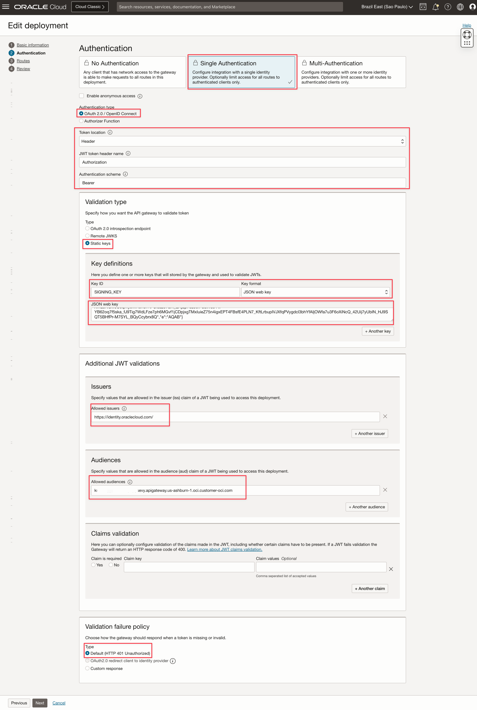

Configure your function created in the last step

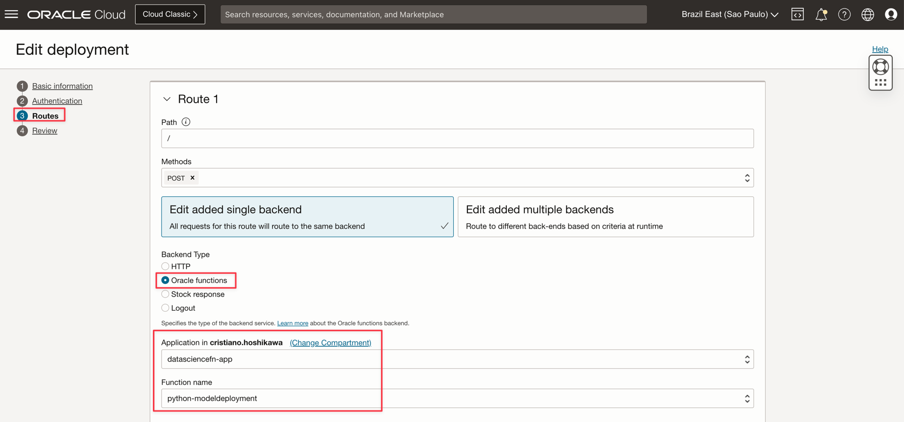

To configure the HEADER model_deployment parameter, you need to click on **Show route request policies** to open the options

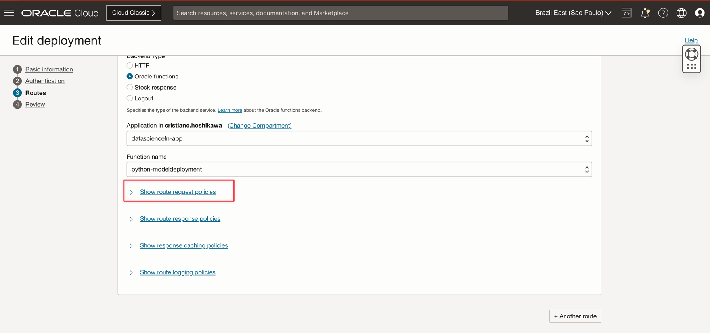

In the **HEADER transformations**, click the Add button

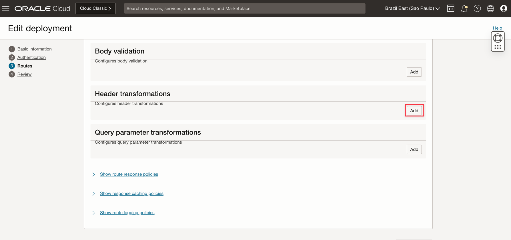

You will need the **Data Science Model Deployment Prediction** URL and you can obtain this here. Go to the Data Science Menu, select your Data Science instance and your Model Deployment. Click in the link **Invoking your model**

>**Note:** Save your Model Deployment OCID here. You will need to configure the Policies later

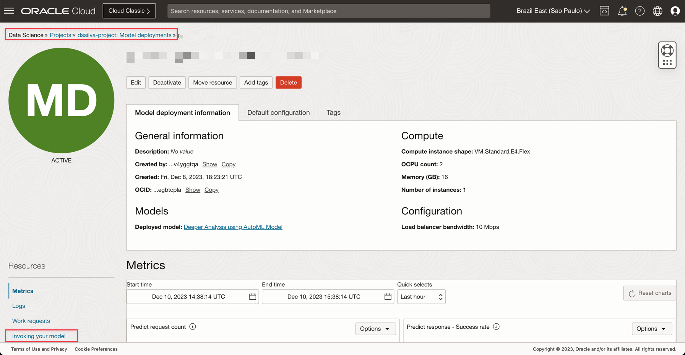

Your URL will be here

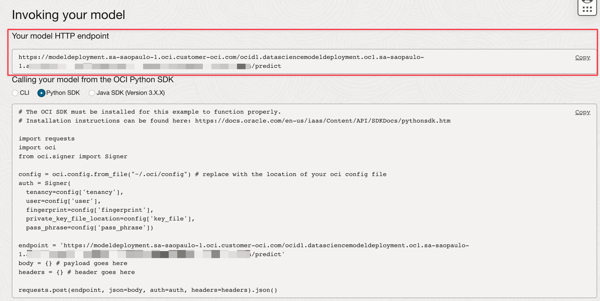

Put the HEADER name (model_deployment) and the **Data Science Model Deployment Prediction** URL

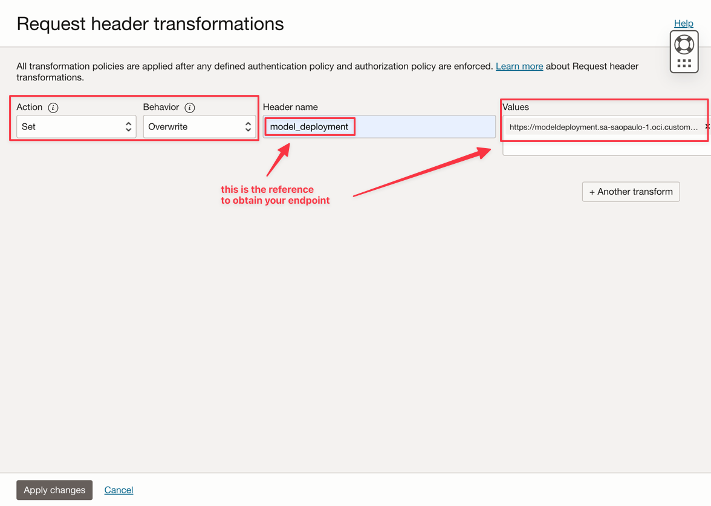

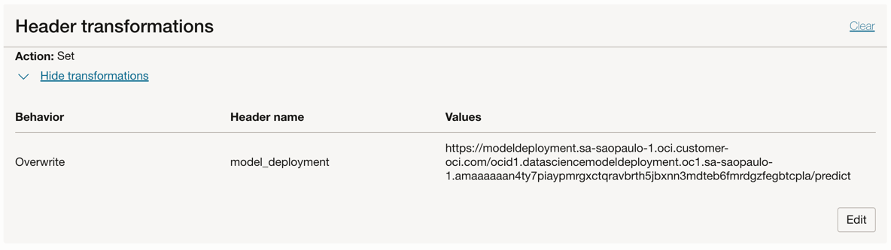

>**Note:** After Save your API Gateway Deployment, remember your API deployment endpoint.

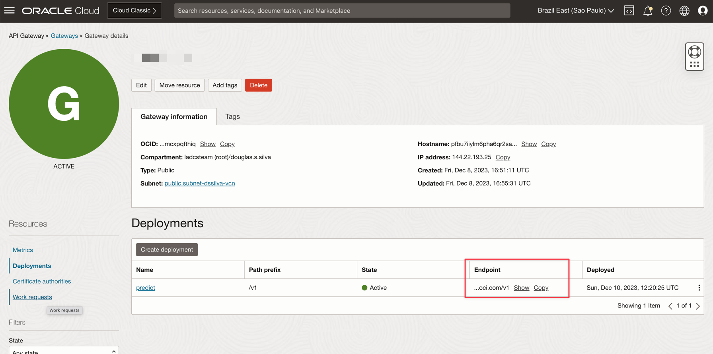

## Task 4: Configure the OCI Group and Policies

Create a Dynamic Group to grant access from **OCI Functions** to your OCI Resource. In this tutorial, we are using the **Data Science Model Deployment**.

If you don't know how to use Resource Principal, see [Resource Principal](https://accelerated-data-science.readthedocs.io/en/latest/user_guide/cli/authentication.html).

You need to obtain the **OCID** of your **Model Deployment** instance. Put the OCID in the dynamic group string

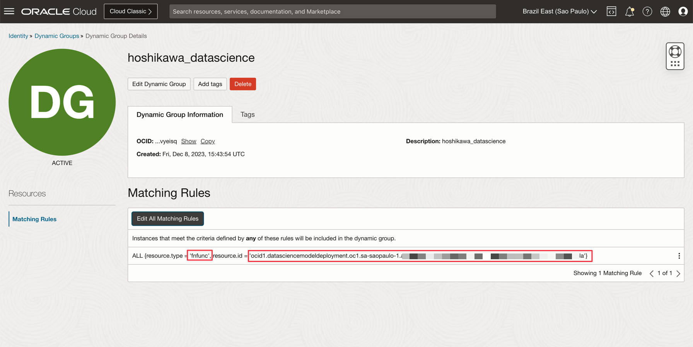

    ALL {resource.type = 'fnfunc', resource.id = 'ocid1.datasciencemodeldeployment.oc1.sa-saopaulo-1.xxxxxxxxxxxxxxxxxxxxxxxxxxxxxxxxxxxxxxxxxxxxxxxx'}
    Note: The resource.id is the OCID obtained previously in the Model Deployment console screen

Now, create a Policy to allow your Dynamic Group

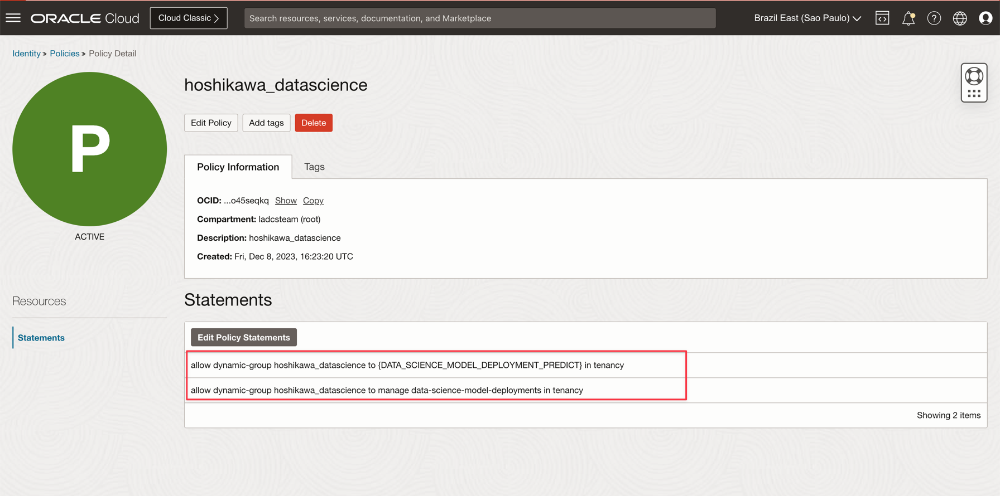

    allow dynamic-group hoshikawa_datascience to {DATA_SCIENCE_MODEL_DEPLOYMENT_PREDICT} in tenancy	
    allow dynamic-group hoshikawa_datascience to manage data-science-model-deployments in tenancy	

This is the documentation for [Model Deployment Policies](https://docs.oracle.com/en-us/iaas/data-science/using/model-dep-policies-auth.htm)

## Task 5: Test API

Now let's simulate your Application OAuth2 request for your Model Deployment Service in **OCI Data Science**.

First, obtain the token passing the **Client ID** and **Client Secret** to your IDCS Provider.

Put your **OCI API Gateway** deployment endpoint and select **POST** verb to your REST request.

Copy the **access_token** value and pass to your **OCI API Gateway** deployment. Remember that your token have 1 hour duration.

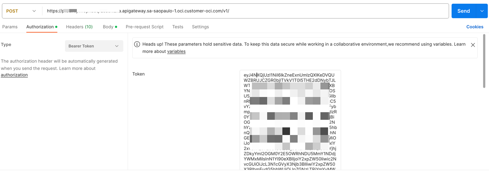

And here is the result !!!

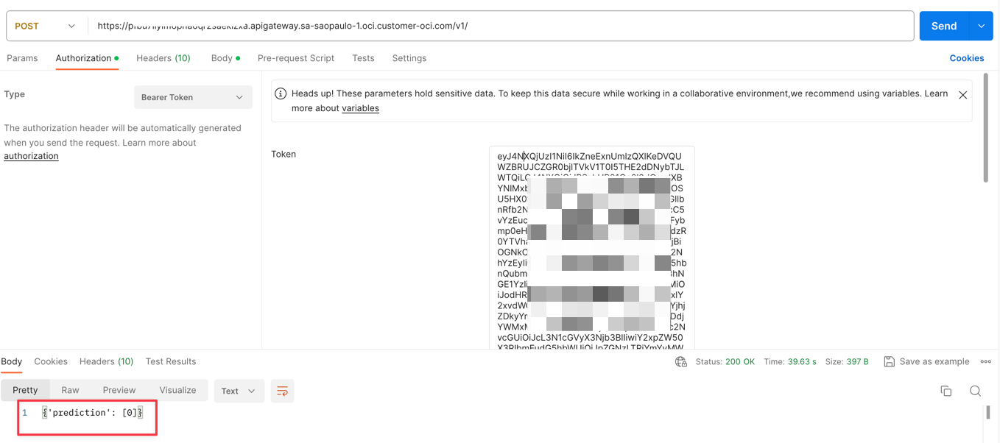

## Related Links

* [Creating Your First API Gateway In The Oracle Cloud](https://blogs.oracle.com/developers/post/creating-your-first-api-gateway-in-the-oracle-cloud)
* [Resource Principal](https://accelerated-data-science.readthedocs.io/en/latest/user_guide/cli/authentication.html).
* [OCI Functions Quickstart](https://docs.oracle.com/en-us/iaas/developer-tutorials/tutorials/functions/func-setup-cli/01-summary.htm)
* [Call a function using API Gateway](https://docs.public.oneportal.content.oci.oraclecloud.com/en-us/iaas/developer-tutorials/tutorials/functions/func-api-gtw/01-summary.htm)
* [Using Resource Principals in the Data Science service](https://blogs.oracle.com/ai-and-datascience/post/feature-highlight-using-resource-principals-in-the-data-science-service)
* [Data Science: Invoking a Model Deployment](https://docs.oracle.com/en-us/iaas/data-science/using/model-dep-invoke.htm)
* [Model Deployment Policies](https://docs.oracle.com/en-us/iaas/data-science/using/model-dep-policies-auth.htm)

## Acknowledgments

* **Author** - Cristiano Hoshikawa (Oracle LAD A-Team Solution Engineer)
